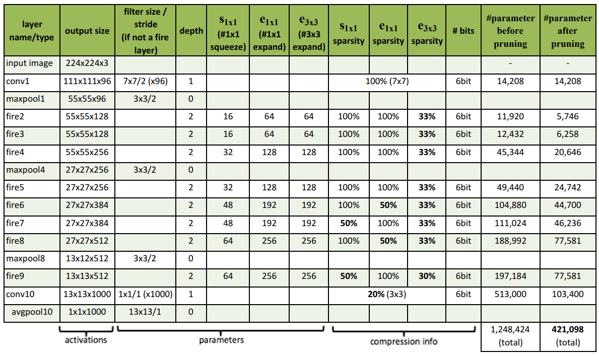
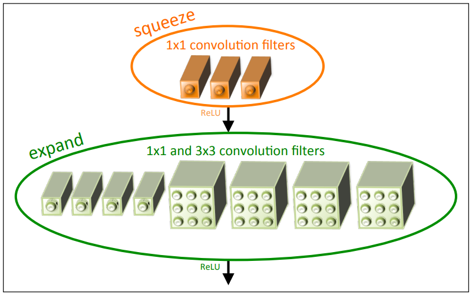
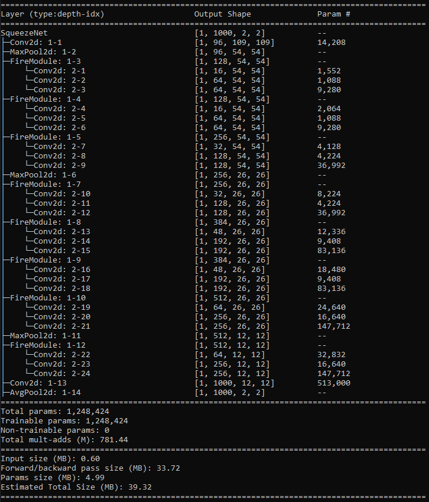

# SqueezeNet-Implementation

"SqueezeNet: AlexNet-level accuracy with 50x fewer parameters and &lt;0.5MB model size" by Forrest N. Iandola, Song Han, Matthew W. Moskewicz, Khalid Ashraf, William J. Dally and Kurt Keutzer.

Paper: https://arxiv.org/pdf/1602.07360.pdf

## Architecture



### Fire Module



## Info

No GPU, No Training. So, run script below to checkout the model informations.

```sh
python info.py
```



## Usage

Before running the script, place your data directory location for both train and test data in `root_dir="{DIR}"` here at [dataloader.py](./dataloader/dataloader.py) or datasets from [torchvision.datasets](https://pytorch.org/vision/0.8/datasets.html)

```sh
python train.py --epochs 100 --num_classes 1000 --version 1.0
```

## Citation

```
@misc{iandola2016squeezenetalexnetlevelaccuracy50x,
      title={SqueezeNet: AlexNet-level accuracy with 50x fewer parameters and <0.5MB model size}, 
      author={Forrest N. Iandola and Song Han and Matthew W. Moskewicz and Khalid Ashraf and William J. Dally and Kurt Keutzer},
      year={2016},
      eprint={1602.07360},
      archivePrefix={arXiv},
      primaryClass={cs.CV},
      url={https://arxiv.org/abs/1602.07360}, 
}
```
